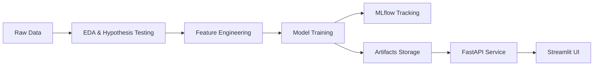

# 📊 Product Sales Forecasting — End-to-End ML System

## 🚀 Project Summary  
Retail businesses operate in a demand-uncertain environment where inaccurate forecasts lead to **lost revenue, excess inventory, and inefficient operations**.  

This project delivers a **production-ready machine learning system** that forecasts:

- 📦 **Daily Order Volume**
- 💰 **Sales Revenue**

across multiple stores using historical data, temporal signals, and business drivers like promotions and holidays.

> ⚡ Built as a **complete ML system** — covering EDA, hypothesis testing, feature engineering, model training, experiment tracking, API deployment, and UI integration.

---

## 🧩 Business Problem  

Retailers need to answer:

- How much stock should we maintain?
- When will demand spike or drop?
- How do discounts and holidays impact sales?
- Which stores/regions drive the most revenue?

### 🎯 Objective  
Build a system that:
- Accurately forecasts **orders and sales**
- Captures **seasonality, trends, and promotions**
- Is **deployable and scalable** in production

---

## 🏗️ Solution Architecture  



---
## 📊 Dashboard  

[View Interactive Dashboard on Tableau Public](https://public.tableau.com/views/salesforecastdashboard_17767878247620/SalesOverview?:language=en-US&:sid=&:redirect=auth&:display_count=n&:origin=viz_share_link)

---

## 📊 Exploratory Data Analysis  

Key analyses performed:

- 📈 **Time Series Analysis** → trend, seasonality, cyclic patterns  
- 🔗 **Correlation Analysis** → Orders vs Sales  
- 📦 **Categorical Analysis** → Store type, region, location impact  
- 🎯 **Promotion Impact** → Discounts influence demand  
- 📅 **Holiday Effects** → Demand variation on holidays  

### 🧪 Hypothesis Testing  

| Hypothesis | Result |
|----------|--------|
| Discounts increase sales | ✅ Supported |
| Holidays impact demand | ✅ Supported |
| Store types differ in performance | ✅ Significant variation |
| Orders correlate with sales | ✅ Strong correlation |

---

## ⚙️ Feature Engineering  

- ⏳ Lag features (`t-1`, `t-7`)  
- 📊 Rolling statistics (7-day mean, trends)  
- 📅 Date features (day, month, weekday, weekofyear)  
- 🏷️ Categorical encoding  
- 🎯 Promotion & holiday indicators  

---

## 🤖 Modeling Approach  

### Models Experimented  

- Linear Regression (baseline)  
- Random Forest  
- **XGBoost / LightGBM (final model)**  

### 🔧 Hyperparameter Tuning  
- Optuna  
- MLflow for experiment tracking  

### 📏 Evaluation Metrics  

- MAE  
- RMSE  
- WAPE  

---

## 📈 Results  

- 📉 Reduced error vs baseline  
- 🎯 Good generalization on unseen data  
- 📊 Stable performance across stores  

---

## ⚡ Quickstart(Prerequisites)  

```bash
# Create environment
python -m venv .venv

# Activate
# Windows:
.\.venv\Scripts\activate

# Install dependencies
pip install -r requirements/base.txt
pip install -r requirements/ml.txt
pip install -r requirements/api.txt

# Train model
python ml_main.py
```

---

## 🌐 Production Deployment  

### 🔌 API (FastAPI)  

**Run API:**
```bash
uvicorn app.main:app --reload --env-file .env
```

**Swagger Docs:**  
http://127.0.0.1:8000/product_sales_forecasting/v1/docs

**Endpoint:**  
POST /forecast/recursive_order_sales_forecast

**Sample Request:**
```json
{
  "Store_id": 1,
  "Store_Type": "S1",
  "Location_Type": "L3",
  "Region_Code": "R1",
  "Prediction_Start_Date": "2019-05-12",
  "period": 7
}
```

---

## 🖥️ Streamlit UI  

```bash
streamlit run streamlit_ui.py
```

---

## 🐳 Docker  

```bash
docker build -t product-sales-forecasting .
docker run -p 8000:8000 -d product-sales-forecasting
```

Prebuilt image:
```bash
docker pull gkaustuv/product-sales-forecasting
```

---

## 📁 Project Structure  

```bash
.
├── app/            # FastAPI production service
├── ml/             # ML pipeline
├── artifacts/      # Saved models
├── data/           # Dataset
├── notebooks/      # EDA & experiments
├── requirements/   # Dependencies
```

---

## 🧠 Key Engineering Decisions  

- Separate ML and API layers  
- Time-series aware validation  
- Modular feature pipeline  
- MLflow for reproducibility  
- Docker for deployment  

---

## 🔮 Future Improvements  

- LSTM / Deep Learning models  
- Real-time pipeline (Kafka)  
- CI/CD automation  
- Model monitoring & drift detection  

---

## 💡 Highlights  

- ✅ End-to-end ML system  
- ✅ Production-ready APIs  
- ✅ Business-focused insights  
- ✅ Scalable architecture  

---

## 👤 Author  

**Kaustuv Gupta**  
Machine Learning | Data Science | MLOps  
